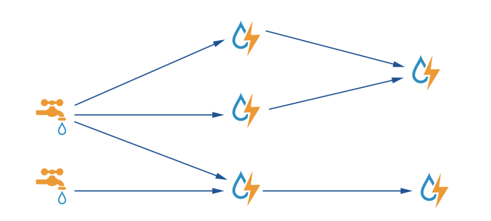

  <h1 align="center">Storm流处理引擎</h1>
  

    <a href="README.md"><strong>English</strong></a> | <strong>简体中文</strong>
  

## 目录

- [仓库简介](#项目介绍)
- [前置条件](#前置条件)
- [镜像说明](#镜像说明)
- [获取帮助](#获取帮助)
- [如何贡献](#如何贡献)

## 项目介绍
[Apache Storm](https://github.com/apache/Storm) 是一种实时计算框架工具。它可以处理无限的数据流，提供了低延迟、高吞吐量的实时数据处理能力。

**核心特性：**
1. 高性能，低延迟：可以应用于广告搜索引擎这种要求对广告主的操作进行实时响应的场景。
2. 分布式：可以轻松应对数据量大，单机无法处理的场景。
3. 可扩展：随着业务发展，数据量和计算量越来越大，系统可水平扩展。
4. 容错：单个节点故障不影响应用。

**架构设计：**

本项目提供的开源镜像商品 [**Storm流处理引擎**](https://marketplace.huaweicloud.com)，已预先安装 Storm 软件及其相关运行环境，并提供部署模板。快来参照使用指南，轻松开启“开箱即用”的高效体验吧。

> **系统要求如下：**
> - CPU: 4GHz 或更高
> - RAM: 8GB 或更大
> - Disk: 至少 60GB

## 前置条件
[注册华为账号并开通华为云](https://support.huaweicloud.com/usermanual-account/account_id_001.html)

## 镜像说明

| 镜像规格                                                                                                        | 特性说明                                         | 备注 |
|-------------------------------------------------------------------------------------------------------------|----------------------------------------------| --- |
| [Storm2.8.2-kunpeng-v1.0](https://github.com/HuaweiCloudDeveloper/Storm-image/tree/Storm2.8.2-kunpeng-v1.0) | 基于 鲲鹏服务器 + Huawei Cloud EulerOS 2.0 64bit 安装部署 |  |

## 获取帮助
- 更多问题可通过 [issue](https://github.com/HuaweiCloudDeveloper/Storm-image/issues) 或 华为云云商店指定商品的服务支持 与我们取得联系
- 其他开源镜像可看 [open-source-image-repos](https://github.com/HuaweiCloudDeveloper/open-source-image-repos)

## 如何贡献
- Fork 此存储库并提交合并请求
- 基于您的开源镜像信息同步更新 README.md
