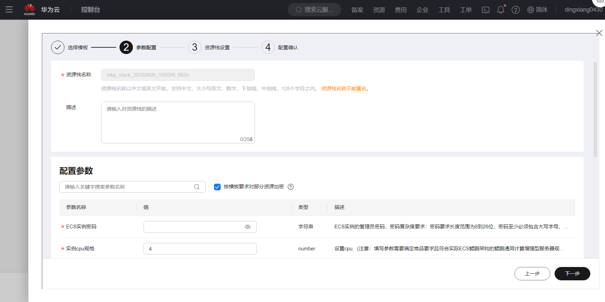

# Storm使用指南

# 一、商品链接

[Storm流处理引擎](https://marketplace.huaweicloud.com)

# 二、商品说明
**Storm** 是一种实时计算框架工具。它可以处理无限的数据流，提供了低延迟、高吞吐量的实时数据处理能力。

# 三、商品购买

您可以在云商店搜索 **Storm流处理引擎**。

其中，地域、规格、推荐配置使用默认，购买方式根据您的需求选择按需/按月/按年，短期使用推荐按需，长期使用推荐按月/按年，确认配置后点击“立即购买”。


## 3.1 使用 RFS 模板直接部署

必填项填写后，点击 下一步


创建直接计划后，点击 确定


点击部署，执行计划

如下图“Apply required resource success. ”即为资源创建完成


##  3.2 ECS 控制台配置

### 准备工作

在使用ECS控制台配置前，需要您提前配置好 **安全组规则**。

> **安全组规则的配置如下：**
> - 入方向规则 放通2181,2888,3888,8888,6700-6703 端口,如指定ip,对应的源地址内必须包含您的客户端ip，否则无法访问 
> - 入方向规则放通 CloudShell 连接实例使用的端口 `22`，以便在控制台登录调试
> - 出方向规则一键放通

### 创建ECS

前提工作准备好后，选择 ECS 控制台配置跳转到[购买ECS](https://support.huaweicloud.com/qs-ecs/ecs_01_0103.html) 页面，ECS 资源的配置如下图所示：

选择CPU架构

选择服务器规格

选择镜像

其他参数根据实际情况进行填写，填写完成之后，点击立即购买即可


> **值得注意的是：**
> - VPC 您可以自行创建
> - 安全组选择 [**准备工作**](#准备工作) 中配置的安全组；
> - 弹性公网IP选择现在购买，推荐选择“按流量计费”，带宽大小可设置为5Mbit/s；
> - 高级配置需要在高级选项支持注入自定义数据，所以登录凭证不能选择“密码”，选择创建后设置；
> - 其余默认或按规则填写即可。

# 四、商品使用

## 修改服务器域名
```shell
vim /etc/hosts
192.168.0.X ecs-0000  修改成本机服务器ip及对应ecs名称
```

## 配置/启动zookeeper 服务
* 配置zookeeper
```shell
vim /opt/zookeeper/conf/zoo.cfg
```
替换实际ecs名称  
server=ecs-0000:2888:3888  

* 启动zookeeper 服务  
```shell
sh /opt/zookeeper/zookeeper/bin/zkServer.sh start
```

## 配置/启动Storm 服务
* 配置Storm
```shell
vim /opt/storm/conf/storm.yaml

替换实际ecs名称
storm.zookeeper.servers:
      - "ecs-0000"
#     - "server2"
nimbus.seeds: ["ecs-0000"]
ui.port: 8888
```

## 后台启动Storm相关服务 
```shell
sh /opt/storm/bin/storm nimbus & 
sh /opt/storm/bin/storm supervisor &
sh /opt/storm/bin/storm ui &
```

* jps检查服务启动情况  
6946 QuorumPeerMain   -- zookeeper  
7603 UIServer  
7415 Supervisor  
8266 Jps  
7178 Nimbus  

* 查看Storm版本  
```shell
source /etc/profile
storm version
```
Storm 2.8.2  
Branch v2.8.2  

## 使用公网ip访问Storm的web UI页面
http://公网eip:8888/

## 运行一个Storm拓扑案例
storm jar /opt/storm/examples/storm-starter/target/storm-starter-2.8.2.jar org.apache.storm.starter.StatefulTopology  
通过 Storm UI (http://公网eip:8888/) 可以监控拓扑的运行情况


## 参考文档
[Storm官网](https://storm.apache.org/index.html)
